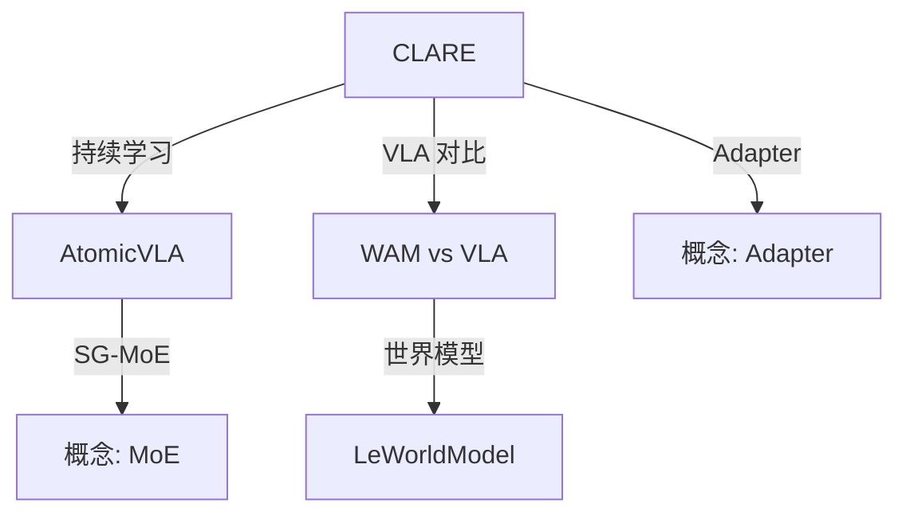

# Concept Weaver - 概念织网器

发现论文之间的隐藏关联，构建知识网络。

## 运行模式

### 增量模式（默认）

只处理新增/修改的论文，通过 `.weaver_state.json` 记录处理历史。

```bash
python3 scripts/weave_concepts.py --notes-dir "/path/to/Papers" --concepts-dir "/path/to/Concepts/MOCs"
```

### 全量模式

重新扫描所有论文：

```bash
python3 scripts/weave_concepts.py --notes-dir "/path/to/Papers" --concepts-dir "/path/to/Concepts/MOCs" --full-scan
```

### 更新范围

| 选项 | 说明 |
|------|------|
| `--auto-update full` | 更新笔记关联 + 生成 MOC（默认） |
| `--auto-update moc_only` | 只生成 MOC |
| `--auto-update links_only` | 只更新笔记关联 |
| `--auto-update none` | 只生成报告 |

## 工作流程

### Step 0: 读取配置

```bash
# 读取共享配置
cat ../_shared/user-config.json
```

获取：
- `VAULT_PATH`
- `NOTES_PATH`
- `CONCEPTS_PATH`

### Step 1: 扫描现有笔记

```bash
# 扫描论文笔记
ls -la {NOTES_PATH}/*.md

# 扫描概念笔记
ls -la {CONCEPTS_PATH}/*.md
```

### Step 2: 提取论文元数据

从每篇论文笔记中提取：

| 字段 | 提取方式 |
|------|----------|
| **标题** | `# Title` |
| **关键词** | 方法名、模型名、技术术语 |
| **问题领域** | "核心问题" section |
| **方法类别** | "方法架构" section |
| **关联论文** | "相关论文" section |
| **arXiv ID** | 元数据 block |

### Step 3: 发现关联

#### 3.1 关键词重叠

```
论文 A 关键词: {VLA, 持续学习, adapter}
论文 B 关键词: {VLA, 持续学习, MoE}
                ↑ 重叠度 = 2/3
```

**关联强度** = Jaccard 相似度

#### 3.2 方法相似性

| 方法类别 | 示例 |
|----------|------|
| 架构创新 | MoE, Adapter, Attention 变体 |
| 训练策略 | 持续学习, 元学习, 迁移学习 |
| 应用领域 | 机器人操作, 导航, 视觉问答 |

#### 3.3 问题相关性

同一问题领域的论文应该关联：
- VLA 持续学习
- 世界模型
- 技能学习
- 奖励建模

### Step 4: 生成关联矩阵

```
              CLARE  AtomicVLA  WAMvsVLA  LeWorldModel
CLARE           -      0.85      0.60        0.30
AtomicVLA     0.85      -        0.70        0.25
WAMvsVLA      0.60     0.70       -          0.80
LeWorldModel  0.30     0.25      0.80         -
```

**阈值**：
- 强关联 > 0.7：添加双向链接
- 中关联 0.5-0.7：添加到"相关论文"
- 弱关联 < 0.5：忽略

### Step 5: 更新笔记

#### 5.1 添加关联 section

在论文笔记末尾添加：

```markdown
## 🔗 相关论文

### 强关联
- [[AtomicVLA]] - 同样解决 VLA 持续学习，但用 SG-MoE 而非 adapter
- [[WAM vs VLA]] - 对比 WAM 和 VLA 的泛化能力

### 方法对比

| 特点 | CLARE | AtomicVLA |
|------|-------|-----------|
| 路由方式 | Autoencoder 重构误差 | 原子技能抽象嵌入 |
| 持续学习 | ✅ 无遗忘 | ✅ 无遗忘 |
| Thinking+Acting | ❌ | ✅ |
```

#### 5.2 生成主题 MOC

运行脚本生成主题聚合页面：

```bash
python3 ../_shared/generate_topic_mocs.py
```

**输出位置**：`{TOPIC_MOC_PATH}/`（配置中的 `Concepts/MOCs/`）

**生成的 MOC 示例**：

```markdown
# VLA-持续学习

**核心问题**: VLA 模型如何在学习新任务时避免遗忘？

共 3 篇相关论文

## 解决方案

| 方法 | 核心思想 | 论文 |
|------|----------|------|
| CLARE | 无样本持续学习框架... | [[CLARE]] |
| AtomicVLA | SG-MoE 技能专家路由... | [[AtomicVLA]] |

## 相关概念
- [[Catastrophic_Forgetting]]
- [[Adapter]]
- [[MoE]]
```

**主题发现规则**：基于论文标签匹配，见 `generate_topic_mocs.py` 中的 `topic_rules`。

### Step 6: 生成可视化（可选）

使用 Mermaid 或 Graphviz：



---

## 概念分类体系

### 按研究领域

```
├── VLA (Vision-Language-Action)
│   ├── 持续学习
│   │   ├── CLARE
│   │   └── AtomicVLA
│   ├── 世界模型
│   │   ├── LeWorldModel
│   │   └── WAM vs VLA
│   └── 部署优化
│
├── 世界模型
│   ├── JEPA
│   │   └── LeWorldModel
│   └── Diffusion
│
├── RL 理论
│   ├── Maximum Likelihood RL
│   └── IRL
│
└── 终身学习
    ├── Skill Plugin
    ├── Meta Learning
    └── Adapter/MoE
```

### 按方法类别

```
├── 架构
│   ├── MoE
│   ├── Adapter
│   └── Attention
│
├── 训练策略
│   ├── 持续学习
│   ├── 元学习
│   └── 迁移学习
│
└── 优化目标
    ├── 最大似然
    ├── 世界模型
    └── 奖励建模
```

---

## 使用示例

### 整理所有论文

```
用户: 整理一下我的论文笔记
```

执行流程：
1. 扫描所有论文笔记
2. 提取元数据和关键词
3. 计算关联矩阵
4. 更新笔记，添加链接
5. 生成概念 MOC

### 特定主题整理

```
用户: 整理 VLA 相关的论文
```

执行流程：
1. 筛选包含 "VLA" 关键词的论文
2. 分析它们之间的关系
3. 生成主题 MOC

### 概念演化分析

```
用户: 分析世界模型的发展脉络
```

执行流程：
1. 按时间排序相关论文
2. 分析方法演进
3. 生成演化图

---

## 输出格式

### 控制台报告

```
📊 概念织网报告
================

发现 5 篇论文，3 个概念

🔗 强关联 (3)
- CLARE ↔ AtomicVLA (0.85) - VLA 持续学习
- WAM vs VLA ↔ LeWorldModel (0.80) - 世界模型对比
- CLARE ↔ WAM vs VLA (0.60) - VLA 相关

📝 已更新笔记 (5)
- CLARE: 添加关联 → AtomicVLA, WAM vs VLA
- AtomicVLA: 添加关联 → CLARE
- ...

📁 已创建 MOC (2)
- VLA 持续学习.md
- 世界模型.md
```

### Obsidian 更新

1. 论文笔记末尾添加「🔗 相关论文」section
2. 创建概念 MOC 文件
3. 更新主 MOC（如存在）

---

## 注意事项

1. **幂等性**：重复运行不会创建重复链接
2. **增量更新**：只处理新增/修改的论文
3. **用户确认**：重要关联变更前询问用户
4. **Git 同步**：更新后自动 commit

---

## 与其他技能的协作

```
paper-reader → 生成单篇论文笔记
       ↓
concept-weaver → 发现关联，构建网络
       ↓
generate-mocs → 生成目录页
```
