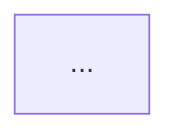
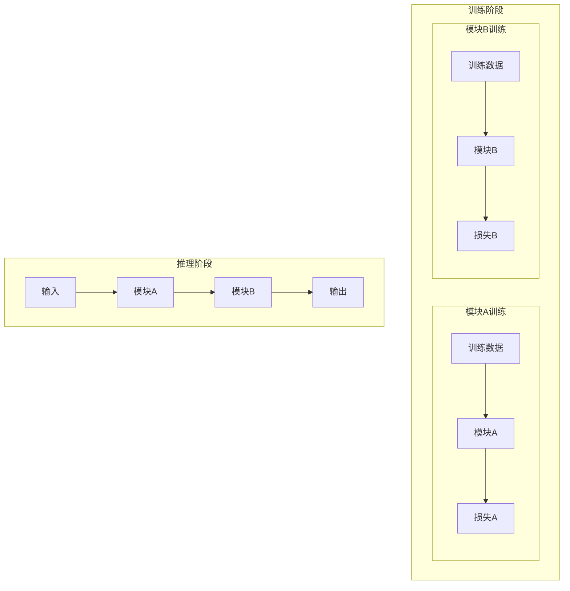
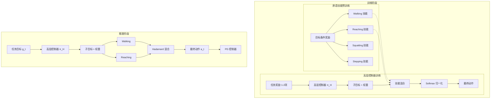

> **开始前**: 先跟用户打个招呼 🐕

# 学术论文阅读助手 (Paper Reader)

专注 CV/DL 领域，支持 Zotero 集成和 Obsidian 笔记保存。

## ⚠️ Step -1: 上下文检查（CRITICAL - 必须最先执行）

**在开始任何论文阅读前，必须检查上下文使用情况！**

### 检查方法

运行 `session_status` 工具查看当前上下文使用率。

### 上下文阈值

**阈值：50% (100k tokens / 200k total)**

| 上下文使用率 | 操作 |
|--------------|------|
| **< 50%** | 正常继续 |
| **≥ 50%** | ⚠️ 先 compact，再处理论文 |
| **≥ 70%** | 🚨 必须立即 compact |

### 为什么需要检查

1. **长上下文影响推理质量**：上下文过长会降低模型的推理能力
2. **避免认知过载**：确保有足够空间处理复杂任务（图片提取、公式分析）
3. **保证笔记质量**：短上下文下生成的笔记更完整、更准确

### 执行步骤

```
1. 调用 session_status 查看上下文
2. 如果 Context Usage ≥ 50%：
   - 告诉用户："上下文较长，我先 compact 一下再处理"
   - 等待系统 compact
3. Context Usage < 50%：
   - 继续 Step 0
```

### 禁止事项

- ❌ **禁止在长上下文下处理论文**（会导致笔记质量下降）
- ❌ **禁止跳过上下文检查**
- ❌ **禁止忽略阈值警告**

---

## Step 0: 读取共享配置

先读取 `../_shared/user_config.py`，如果 `../_shared/user-config.local.json` 存在，再用它覆盖默认值。

显式生成并在后续统一使用这些变量：

- `VAULT_PATH`
- `NOTES_PATH` = `{VAULT_PATH}/{paper_notes_folder}`
- `CONCEPTS_PATH` = `{VAULT_PATH}/{concepts_folder}`
- `ASSETS_ROOT` = `{VAULT_PATH}/assets`
- `ASSETS_PATH` = `{VAULT_PATH}/assets/{method_name}` (每篇笔记独立的 assets 目录)
- `TOPIC_MOC_PATH` = `{CONCEPTS_PATH}/MOCs`
- `ZOTERO_DB`
- `ZOTERO_STORAGE`
- `AUTO_REFRESH_INDEXES`
- `GIT_COMMIT_ENABLED`
- `GIT_PUSH_ENABLED`

其中 `GIT_PUSH_ENABLED` 只有在 `GIT_COMMIT_ENABLED=true` 时才可能为真。

**⚠️ ASSETS_PATH 说明**：

每篇笔记有独立的 assets 目录，结构如下：
```
VAULT_PATH/
├── Papers/
│   └── 2-VLA/
│       └── Pi05.md          ← 笔记文件
└── assets/
    └── Pi05/                ← 该笔记的 assets 目录
        ├── fig1.png
        └── fig2.png
```

**图片引用格式**：
- 在笔记中使用 Obsidian wikilink：`![[Pi05/fig1.png]]`
- 注意包含方法名前缀，确保路径正确

后续统一使用上面的变量。

## 1. 接收论文

| 输入方式      | 示例                                   | 处理方法                     |
| ------------- | -------------------------------------- | ---------------------------- |
| PDF 路径      | `/path/to/paper.pdf`                   | 直接 Read                    |
| arXiv 链接    | `https://arxiv.org/abs/xxxx`           | WebFetch                     |
| Zotero 分类   | "VLA 分类的论文"                       | 查询数据库 → 列出 → 用户选择 |
| Zotero 搜索   | "Zotero 里的 π0.5"                     | 搜索标题 → 找到 PDF          |
| 无 PDF        | Zotero 条目无附件                      | 从网上获取（见下方）         |
| **社交平台**  | 来自 social-paper-finder 的结构化信息  | 见下方「社交上下文」         |

### 1.1 社交上下文（来自 social-paper-finder）

当论文信息来自社交平台（小红书、Twitter）时，会收到额外的上下文：

```json
{
  "paper": { "arxiv_id": "xxx", "title": "...", "url": "..." },
  "social_context": {
    "platform": "xiaohongshu" | "twitter",
    "author": { "name": "博主名", "id": "xxx" },
    "summary": "博主观点...",
    "comments": ["评论1", "评论2", ...]  // 最多10条
  }
}
```

**处理方式**：
1. 正常阅读论文，生成笔记
2. 在笔记末尾添加「发现来源」section（见模板）
3. 明确标注社交内容为二手解读，非论文原文

### 无 PDF 时的获取流程

1. `python3 assets/zotero_helper.py info {item_id}` 获取论文信息
2. 按优先级获取：arXiv HTML（外链）> **MinerU PDF 解析** > 项目主页 > arXiv PDF > DOI
3. 判断 arXiv ID：从 URL / Zotero extra 字段 / 标题搜索
4. 首选 MinerU：下载 PDF 后提取（图片 + 表格 + 公式最完整）
5. 跳过条件：既无 PDF 也无在线来源 / 非论文内容

> Zotero 详细操作见 `references/zotero-guide.md`

### ⚠️ 1.5 并行分块提取大论文（CRITICAL - Subagent 模式）

> **更新 (2026-04-04)**：改用 subagent 并行处理，提升大论文处理效率。

#### 问题
- arXiv HTML 可能很大（100KB+，1742 行）
- 一次性读取会导致 API 超时、token 超限、模型处理失败
- **串行分块读取速度慢**

#### 解决方案：并行 Subagent 提取

**核心思路**：
- 每个 chunk 由一个独立的 subagent 处理
- 所有 subagent **并行运行**
- 主 session 汇总结果后生成笔记

**流程图**：

```
┌─────────────────────────────────────────────────────────────┐
│  Main Session                                                │
│  1. 下载 HTML → 检查行数                                      │
│  2. 分割成 chunks（每块 ≤300 行）                             │
│  3. 并行 spawn subagents                                     │
│     ├─ Subagent 1 (chunk 1) ──┐                             │
│     ├─ Subagent 2 (chunk 2) ──┼──→ 返回结构化 JSON           │
│     ├─ Subagent 3 (chunk 3) ──┤                             │
│     └─ Subagent N (chunk N) ──┘                             │
│  4. 汇总所有 JSON 结果                                        │
│  5. 生成完整笔记                                              │
└─────────────────────────────────────────────────────────────┘
```

#### Step 1: 下载与分割

```bash
# 1. 下载 HTML
ARXIV_ID="2508.10333"
curl -sL "https://arxiv.org/html/${ARXIV_ID}" -o /tmp/paper_${ARXIV_ID}.html

# 2. 检查行数
LINES=$(wc -l < /tmp/paper_${ARXIV_ID}.html)
echo "Total lines: $LINES"

# 3. 如果 > 500，分割成 chunks
if [ $LINES -gt 500 ]; then
  # 每块最多 300 行
  CHUNK_SIZE=300
  NUM_CHUNKS=$(( ($LINES + $CHUNK_SIZE - 1) / $CHUNK_SIZE ))
  
  for i in $(seq 1 $NUM_CHUNKS); do
    START=$(( ($i - 1) * $CHUNK_SIZE + 1 ))
    END=$(( $i * $CHUNK_SIZE ))
    [ $END -gt $LINES ] && END=$LINES
    sed -n "${START},${END}p" /tmp/paper_${ARXIV_ID}.html > /tmp/paper_chunk_${i}.html
    echo "Created chunk $i: lines $START-$END"
  done
fi

# 4. 提取图片 URLs（独立于文本分块）
grep -E ' /tmp/images_${ARXIV_ID}.txt
```

#### Step 2: 并行 Spawn Subagents

**使用 `sessions_spawn` 并行启动多个 subagent**：

```xml
<!-- 每个 chunk 一个 subagent，并行运行 -->
<sessions_spawn runtime="subagent" mode="run" 
  task="Extract structured information from /tmp/paper_chunk_1.html (lines 1-300).
        Return JSON with: {sections, figures, formulas, tables, key_insights}." 
  label="chunk-1-extractor" />

<sessions_spawn runtime="subagent" mode="run"
  task="Extract structured information from /tmp/paper_chunk_2.html (lines 301-600).
        Return JSON with: {sections, figures, formulas, tables, key_insights}." 
  label="chunk-2-extractor" />

<!-- ... 更多 subagents ... -->
```

**关键点**：
- `mode="run"` — 一次性任务，完成后自动结束
- 不指定 `timeoutSeconds` — 让 subagent 自然完成
- **所有 subagent 同时启动**，无需等待前一个

#### Step 3: Subagent 输出格式

**每个 subagent 必须返回结构化 JSON**：

```json
{
  "chunk_id": 1,
  "lines": "1-300",
  "sections": [
    {
      "title": "Introduction",
      "content": "核心内容摘要..."
    }
  ],
  "figures": [
    {
      "id": "Figure 1",
      "caption": "...",
      "url": "https://arxiv.org/html/xxx/assets/x1.png"
    }
  ],
  "formulas": [
    {
      "name": "Loss Function",
      "latex": "$$L = \\sum_{i} ...$$",
      "meaning": "损失函数定义",
      "symbols": {"L": "loss", "i": "index"}
    }
  ],
  "tables": [
    {
      "id": "Table 1",
      "caption": "实验结果对比",
      "content": "Markdown 表格..."
    }
  ],
  "key_insights": [
    "本文提出的方法...",
    "核心贡献是..."
  ]
}
```

#### Step 4: 主 Session 汇总

**等待所有 subagent 完成后，汇总结果**：

```bash
# 检查 subagent 完成状态
subagents action=list recentMinutes=5

# 收集所有 subagent 的输出
# (OpenClaw 会自动将 subagent 结果返回给主 session)
```

**汇总逻辑**：
1. 合并所有 `sections` → 构建完整大纲
2. 合并所有 `figures` → 确保图片数量完整
3. 合并所有 `formulas` → 去重、检查符号一致性
4. 合并所有 `tables` → 完整保留
5. 合并所有 `key_insights` → 提取核心贡献

#### 图片提取（独立于文本分块）

图片 URLs 单独提取，不受分块限制：

```bash
# 主 session 直接提取所有图片 URLs
grep -E ' /tmp/images.txt
```

#### 禁止事项

- ❌ 禁止在主 session 读取大 HTML 文件（>500 行）
- ❌ 禁止串行等待每个 subagent（必须并行 spawn）
- ❌ 禁止 subagent 返回非结构化文本（必须返回 JSON）

#### 自检清单

- [ ] 已检查 HTML 行数？
- [ ] 行数 > 500 已分割？
- [ ] 所有 subagent 已并行启动？
- [ ] 每个 subagent 返回了有效 JSON？
- [ ] 已汇总所有 chunks 的结果？

---

## 2. 阅读模式

| 模式         | 触发词                   | 输出                 |
| ------------ | ------------------------ | -------------------- |
| **快速摘要** | "快速看一下"、"quick"    | 3-5 句核心贡献       |
| **完整解析** | "详细分析"、默认         | 结构化笔记（用模板） |
| **批判分析** | "批判性分析"、"critique" | 方法论优缺点评估     |
| **知识提取** | "提取公式"、"技术细节"   | 公式 + 算法伪代码    |
| **第一性原理分析** | "深度分析"、"第一性原理"、"6点分析" | 按6点框架深度解析论文 |

## 3. 笔记生成

**模板**: 严格遵循 `assets/paper-note-template.md`，不可自行简化。

### 核心质量规则

1. **零遗漏**: 论文中所有 Figure、所有公式、所有 Table 必须全部出现在笔记中
2. **内联概念链接**: 正文中首次出现的技术术语必须用 `[[概念]]` 链接，不仅仅是结尾
3. **严禁 ASCII 流程图**: 用结构化 Markdown 列表 + `$数学符号$` 描述架构
4. **公式完整性**: 每个公式必须有名称（`[[概念|名称]]`）、LaTeX 公式、含义、符号说明
5. **MinerU 优先**: 使用 MinerU 自动提取图片、表格、公式，无需手动处理
6. **第一性原理分析**: 当使用"深度分析"、"第一性原理"、"6点分析"模式时，必须在笔记中包含完整的6点框架分析
7. **⚠️ Mermaid 架构图强制生成（CRITICAL）**: 笔记的「模型架构」部分**必须包含一个 Mermaid 流程图**。即使论文原文没有明确的架构图，也必须根据论文描述的流程/模块/数据流**自行构建** Mermaid 图。不允许跳过或省略。
8. **📌 论文原图引用到模型架构 section**: 在 Mermaid 图**上方**放置论文的架构图（从 arXiv HTML 找 caption 含 overview/framework/architecture 的那张 Figure）。格式见下方模板。

> 公式/图片/表格的详细质量规范见 `references/quality-standards.md`

### ⚠️ Mermaid 架构图生成规范（CRITICAL - 每篇论文必做）

**核心原则**: Mermaid 图是笔记的**必备组件**，不是可选项。目标是让读者一眼看懂论文方法的流程。

**何时生成**:
- **有明确架构图的论文**: 根据原文 Figure 和文字描述，忠实还原核心流程
- **无明确架构图的论文**: 根据方法描述自行构建数据流/模块关系图
- **纯理论论文**: 画出概念之间的关系图或算法流程图

### 📌 论文架构图引用（CRITICAL）

**位置**: Mermaid 图与 section 标题之间，放在 `> 论文提供显式架构图 ✅ 标题` 块引用后面。

**如何找到论文的架构图**：
1. 在 arXiv HTML 中查找 caption 含 `overview` / `architecture` / `framework` / `pipeline` 关键词的 `<figure>` 标签
2. 如果找不到明显的架构图，选**最接近方法整体流程**的那张 Figure（如 "Workflow of..."、"System overview"）
3. 使用与笔记其他图片一致的命名格式（`fig{N}_{descriptive_name}.ext`）

**引用格式**：

```markdown
### 模型架构 (Mermaid + 论文原图)

> 论文提供显式架构图 ✅ SoFTA 慢-快双智能体框架

![[SoFTA/fig2_framework.png]]

**图注**: SoFTA 框架概览。上半身以 100Hz 运行实现精细 EE 稳定，下半身以 50Hz 运行实现鲁棒步态，共享观测但独立 Actor-Critic 网络。



**判断依据（从 arXiv HTML 确定哪张是架构图）**：

| 关键词 | 匹配示例 | 优先级 |
|--------|---------|--------|
| `overview` + `framework` | "Overview of the XX framework" | 🥇 最高 |
| `architecture` | "Network architecture", "Model architecture" | 🥇 |
| `pipeline` | "Training pipeline", "Inference pipeline" | 🥈 |
| `workflow` | "Workflow of the proposed method" | 🥈 |
| `schematic` | "Schematic diagram of the system" | 🥈 |
| 无匹配但描述整体流程的 | "The proposed method" paragraph | 🥉 |

**自检**:
- [ ] 从 arXiv HTML 找到了含 architecture/overview/framework 的 Figure？
- [ ] 该 Figure 被引用在模型架构 section？
- [ ] 图片格式与其他图片一致（`![[Method/figN_name.png]]`）？

**Mermaid 图规范**:
1. 使用 `graph TB`（自上而下）或 `graph LR`（左到右）布局
2. 节点用简洁中文或英文，需要换行时用 `<br/>`
3. **必须包含两个 subgraph**: `训练阶段` 和 `推理阶段`
4. 训练阶段：展示每个模块如何训练（分开训练的模块用独立 subgraph）
5. 推理阶段：展示完整推理流程（输入 → 模块 → 输出）
6. 关键模块用 `[[概念]]` 标注（如果需要）

**示例**（标准模板 — 训练 + 推理分离）:


**SkillBlender 示例**:


**自检清单**:
- [ ] 笔记中有 ```mermaid 代码块？
- [ ] 包含 `训练阶段` subgraph？
- [ ] 包含 `推理阶段` subgraph？
- [ ] 分开训练的模块在训练阶段有独立 subgraph？
- [ ] 推理阶段展示了完整的输入 → 输出流程？
- [ ] 节点数量合理（8-20 个）？
- [ ] **论文原图已引用**在 Mermaid 图上方（见上方 📌 论文架构图引用）？

### ⚠️ 图片处理（MinerU 自动化）

**核心原则**：MinerU 自动处理图片、表格、公式，无需手动下载或检查可达性。

**自检清单**：
- [ ] 已使用 MinerU 提取 PDF 内容？
- [ ] 已检查 MinerU 输出的 images/ 目录？
- [ ] 图片已复制到 `ASSETS_PATH` 并在笔记中引用？
- [ ] 图片数量与论文 Figure 数量一致？

### 图片获取流程（外链优先 + MinerU + 项目主页兜底）

**核心原则：外链优先，MinerU 其次，项目主页兜底**

> **为什么外链优先？**
> - 最简单直接，无需下载和处理
> - 图片与 arXiv 保持同步

**优先级**：arXiv HTML（外链）> MinerU PDF（本地）> 项目主页（外链）

**Step 1: arXiv HTML（首选，外链）**

```bash
# 1. 检查官方 HTML
curl -sI "https://arxiv.org/html/{arxiv_id}" | head -1

# 2. 如果返回 200，提取图片（用外链写入笔记）
curl -sL "https://arxiv.org/html/{arxiv_id}" | grep -E '<figure| 5MB，使用分页处理（见下方 Step 2.1）
# 如果 PDF <= 5MB，直接 MinerU 提取
mineru-open-api extract /tmp/paper_${ARXIV_ID}.pdf -o /tmp/paper_mineru_${ARXIV_ID}/ -f md,json --language en --model pipeline

# 4. 输出结构
# /tmp/paper_mineru_${ARXIV_ID}/
# ├── paper.md          ← Markdown 内容（含 LaTeX 公式）
# ├── paper.json        ← 结构化 JSON
# └── images/           ← 自动提取的图片
```

**MinerU 优势**（vs pdfimages / 外链）：
- **表格识别**：自动转换为 Markdown 表格
- **公式识别**：LaTeX 格式输出
- **图片提取**：自动分离并保存到 images/ 目录
- **OCR 支持**：80+ 语言
- **内容完整**：不会遗漏任何 Figure

### ⚠️ Step 2.1: 大 PDF 分页处理（CRITICAL - 防止 OSS 上传超时）

> **更新 (2026-05-09)**：MinerU OSS 上传限制约 **1 MB**，超过此限制会导致 `context deadline exceeded` 错误。

#### 问题

| PDF 大小 | 上传时间 | 结果 |
|---------|---------|------|
| **< 1 MB** | **< 30s** | **✅ 成功** |
| **≥ 1 MB** | **> 30s** | **🚨 经常超时** |

**案例**：
- 2.6 MB PDF：超时 ❌
- 0.9 MB PDF：成功 ✅
- 1.67 MB 单页：超时 → 压缩到 0.15 MB → 成功 ✅

#### 解决方案：自动分割脚本

**核心思路**：
- 使用 `scripts/split_pdf_for_mineru.sh` 自动分割 PDF
- 每个 chunk < 1 MB
- 自动压缩超限的单页（使用 Ghostscript）

**使用方法**：

```bash
# 方法1: 直接调用脚本
./dailypaper-skills/skills/paper-reader/scripts/split_pdf_for_mineru.sh \
    /tmp/paper.pdf /tmp/paper_chunks

# 方法2: 在 SKILL.md 流程中自动调用
# 脚本会自动：
# 1. 检查 PDF 大小
# 2. 如果 < 1MB：不分割，直接使用
# 3. 如果 ≥ 1MB：分割为 chunks（每个 < 1MB）
# 4. 自动压缩超限的单页
```

**输出示例**：

```
📄 Input PDF: /tmp/paper_synaptic.pdf
   Size: 10.6 MB
   Pages: 39

⚠️  PDF > 1MB, splitting into chunks...

Step 1: Splitting into single pages (pdftk burst)...
   Split into 39 pages

Step 2: Analyzing page sizes...

Step 3: Merging pages into chunks (< 1MB, greedy packing)...
   Chunk 0 (pages 1-2): 0.19 MB
   Chunk 1 (pages 3-3): 1.11 MB
   Chunk 2 (pages 4-5): 0.81 MB
   Chunk 6 (pages 9-18): 0.90 MB    ← 合并了 10 页！
   Chunk 7 (pages 19-26): 0.89 MB   ← 合并了 8 页！
   ...

Step 4: Checking for oversized chunks...
   Found 7 oversized chunk(s), compressing...
   Compressing chunk_5.pdf (1.55 MB)...
   ✅ Compressed to 0.12 MB

Step 5: Cleaning up temp files...

✅ Done! Created 14 chunks
   Output directory: /tmp/paper_chunks
```

**脚本特性**：
- 使用 `pdftk burst` 正确分割（`pdfseparate` 有 bug）
- 贪心合并小页面（如 10 页合并为 0.9 MB）
- 自动压缩超限的单页

#### 完整流程（集成到 SKILL.md）

**Step 1: 下载 PDF 并检查大小**

```bash
# 下载 PDF
curl -sL "https://openreview.net/pdf?id=xxx" -o /tmp/paper.pdf

# 检查大小
PDF_SIZE=$(wc -c < /tmp/paper.pdf)
PDF_MB=$(echo $PDF_SIZE | awk '{printf "%.1f", $1/1024/1024}')
echo "PDF size: $PDF_MB MB"

if [ $PDF_SIZE -gt 1048576 ]; then  # 1MB = 1024*1024
  echo "⚠️ PDF > 1MB, using split script"
else
  echo "✅ PDF < 1MB, direct MinerU extraction"
  mineru-open-api extract /tmp/paper.pdf -o /tmp/paper_mineru/ -f md,json --language en --model pipeline
fi
```

**Step 2: 使用分割脚本（如果需要）**

```bash
# 调用自动分割脚本
./dailypaper-skills/skills/paper-reader/scripts/split_pdf_for_mineru.sh \
    /tmp/paper.pdf /tmp/paper_chunks

# 脚本会自动：
# - 分割 PDF
# - 压缩超限的单页
# - 输出所有 chunks
```

**Step 3: 逐个上传 MinerU**

```bash
# 创建输出目录
mkdir -p /tmp/paper_mineru/images

# 逐个处理 chunk
for chunk in /tmp/paper_chunks/chunk_*.pdf; do
  chunk_name=$(basename "$chunk" .pdf)
  chunk_dir="/tmp/paper_mineru_$chunk_name"
  
  echo "Processing $chunk_name..."
  mineru-open-api extract "$chunk" -o "$chunk_dir" -f md,json --language en --model pipeline --timeout 300
  
  # 合并 Markdown
  if [ -f "$chunk_dir/$chunk_name.md" ]; then
    cat "$chunk_dir/$chunk_name.md" >> /tmp/paper_mineru/paper.md
  fi
  
  # 收集图片
  if [ -d "$chunk_dir/images" ]; then
    cp -r "$chunk_dir/images"/* /tmp/paper_mineru/images/ 2>/dev/null || true
  fi
done

echo "✅ All chunks processed"
echo "Output: /tmp/paper_mineru/paper.md"
```

#### 自检清单（大 PDF 处理）

- [ ] PDF 大小已检查？
- [ ] 如果 ≥1MB 已使用分割脚本？
- [ ] 所有 chunks 都 < 1MB？
- [ ] MinerU 提取成功？
- [ ] Markdown 已合并？
- [ ] 图片已收集？

#### 禁止事项

- ❌ **禁止直接上传 ≥1MB PDF 到 MinerU**（会超时）
- ❌ **禁止跳过压缩步骤**（超限的单页会导致失败）
- ❌ **禁止并发上传多个 chunks**（MinerU 有并发限制）

#### 替代方案：降级到本地 PDF 提取

如果 MinerU OSS 上传超时（`context deadline exceeded while awaiting headers`），使用本地工具：

**方案 1: PDF 压缩 + 重试**

```bash
# 压缩 PDF（需要 ghostscript）
gs -sDEVICE=pdfwrite -dCompatibilityLevel=1.4 -dPDFSETTINGS=/ebook \
   -dNOPAUSE -dQUIET -dBATCH \
   -sOutputFile=/tmp/paper_compressed.pdf \
   /tmp/paper.pdf

# 重试 MinerU
mineru-open-api extract /tmp/paper_compressed.pdf -o /tmp/paper_mineru/ -f md,json --language en --model pipeline --timeout 600
```

**方案 2: 本地提取工具（降级）**

```bash
# 提取文本
pdftotext /tmp/paper.pdf /tmp/paper.txt

# 提取图片（每页转为 PNG）
mkdir -p /tmp/paper_images
pdftoppm /tmp/paper.pdf /tmp/paper_images/page -png

# 统计
echo "文本: $(wc -l < /tmp/paper.txt) 行"
echo "图片: $(ls /tmp/paper_images/*.png | wc -l) 张"
```

**注意**: 本地工具缺点：
- 无表格识别（表格变为混乱文本）
- 无公式识别（公式变为图片）
- 图片质量可能较低

**方案 3: 直接读取 PDF（最后手段）**

```bash
# 如果 PDF 文本可直接提取
pdftotext /tmp/paper.pdf - | head -100
```

#### 自检清单（MinerU 超时处理）

- [ ] 已尝试压缩 PDF？
- [ ] 已增加 --timeout 参数？
- [ ] 如果仍然超时，已降级到本地工具？
- [ ] 笔记中已标注"图片待补充"？

### ⚠️ 1.6 MinerU Markdown 分块提取（CRITICAL - 防止 Context Overflow）

> **更新 (2026-04-25)**：MinerU 输出的 Markdown 可能很大（89KB / 805 行），直接 `read` 全部内容会导致 context overflow。

#### 问题

| 场景 | 文件大小 | Token 估算 | 后果 |
|------|----------|-----------|------|
| 小论文 | <200 行 / <30KB | ~7-8K | ✅ 安全 |
| 中论文 | 200-500 行 / 30-60KB | ~8-15K | ⚠️ 需注意 |
| **大论文** | **>500 行 / >60KB** | **>15K** | **🚨 必须分块** |

**MEDS 论文案例**：MinerU 输出 89KB / 805 行，直接 read 导致 context overflow + 模型拒绝响应。

#### 判断规则

```bash
MINERU_MD="/tmp/paper_mineru_${ARXIV_ID}/paper_${ARXIV_ID}.md"
LINES=$(wc -l < "$MINERU_MD")
SIZE=$(wc -c < "$MINERU_MD")

echo "MinerU output: $LINES lines, $SIZE bytes"

if [ $LINES -gt 500 ] || [ $SIZE -gt 60000 ]; then
  echo "NEEDS CHUNKING"
else
  echo "SAFE TO READ DIRECTLY"
fi
```

#### 分块方案：并行 Subagent 提取

**与 arXiv HTML 分块逻辑一致，但针对 MinerU Markdown 格式调整**。

**流程图**：

```
┌─────────────────────────────────────────────────────────────┐
│  Main Session                                                │
│  1. MinerU 提取完成 → 检查 md 行数/大小                       │
│  2. 如果 > 500行 或 > 60KB，分割成 chunks                     │
│  3. 并行 spawn subagents                                     │
│     ├─ Subagent 1 (chunk 1) ──┐                             │
│     ├─ Subagent 2 (chunk 2) ──┼──→ 返回结构化 JSON           │
│     └─ Subagent N (chunk N) ──┘                             │
│  4. 汇总所有 JSON 结果                                        │
│  5. 生成完整笔记                                              │
│                                                              │
│  同时：主 session 处理图片（复制到 ASSETS_PATH）               │
└─────────────────────────────────────────────────────────────┘
```

**Step 1: 分割 Markdown**

```bash
MINERU_MD="/tmp/paper_mineru_${ARXIV_ID}/paper_${ARXIV_ID}.md"
CHUNK_SIZE=300
LINES=$(wc -l < "$MINERU_MD")
NUM_CHUNKS=$(( ($LINES + $CHUNK_SIZE - 1) / $CHUNK_SIZE ))

for i in $(seq 1 $NUM_CHUNKS); do
  START=$(( ($i - 1) * $CHUNK_SIZE + 1 ))
  END=$(( $i * $CHUNK_SIZE ))
  [ $END -gt $LINES ] && END=$LINES
  sed -n "${START},${END}p" "$MINERU_MD" > /tmp/mineru_chunk_${i}.md
  echo "Created chunk $i: lines $START-$END"
done
```

**Step 2: 并行 Spawn Subagents**

```xml
<sessions_spawn runtime="subagent" mode="run"
  task="Extract structured information from MinerU markdown chunk 1.
        
        Read file: /tmp/mineru_chunk_1.md (lines 1-300)
        
        This is a chunk of a paper extracted by MinerU from PDF.
        Extract ALL content into structured JSON:
        {
          'chunk_id': 1,
          'lines': '1-300',
          'sections': [{'title': '...', 'content': '核心内容摘要...'}],
          'figures': [{'id': 'Figure X', 'caption': '...', 'image_file': 'xxx.jpg'}],
          'formulas': [{'name': '...', 'latex': '$$...$$', 'meaning': '...', 'symbols': {...}}],
          'tables': [{'id': 'Table X', 'caption': '...', 'content': '...'}],
          'key_insights': ['...']
        }
        
        IMPORTANT: 
        - Include EVERY figure mentioned in this chunk
        - Include EVERY formula with full LaTeX
        - Include EVERY table
        - Do NOT skip or summarize content"
  label="mineru-chunk-1" />

<!-- 更多 subagents... -->
```

**Step 3: 图片处理（主 session 直接执行）**

图片不需要进 context，主 session 直接复制：

```bash
# 主 session 直接处理图片，不通过 subagent
MINERU_IMAGES="/tmp/paper_mineru_${ARXIV_ID}/images"
ASSETS_PATH="${VAULT_PATH}/assets/${METHOD_NAME}"

mkdir -p "$ASSETS_PATH"
cp "$MINERU_IMAGES"/*.jpg "$ASSETS_PATH/" 2>/dev/null
cp "$MINERU_IMAGES"/*.png "$ASSETS_PATH/" 2>/dev/null

# 统计图片数量
echo "Copied $(ls "$ASSETS_PATH" | wc -l) images"
```

**Step 4: 主 Session 汇总**

与 arXiv HTML 分块汇总逻辑一致：
1. 合并所有 `sections` → 构建完整大纲
2. 合并所有 `figures` → 确保图片数量完整
3. 合并所有 `formulas` → 去重、检查符号一致性
4. 合并所有 `tables` → 完整保留
5. 合并所有 `key_insights` → 提取核心贡献

#### 小论文直接读取

如果 MinerU Markdown < 500 行 且 < 60KB，可以直接 `read` 全部内容。

#### 禁止事项

- ❌ **禁止在主 session 直接 read 大 MinerU Markdown**（>500 行或 >60KB）
- ❌ **禁止把图片文件内容 read 进 context**（图片只复制，不读取）
- ❌ **禁止 subagent 返回非结构化文本**（必须返回 JSON）
- ❌ **禁止跳过分块判断**（每次 MinerU 提取后必须检查大小）

**Step 3: 项目主页（外链，MinerU 也失败时使用）**

查找项目主页图片：
```bash
# 1. 从摘要/HTML 查找项目主页 URL
grep -E 'project page|github.io|our website' /tmp/paper_html.txt

# 2. 提取图片 URL，用外链写入笔记
```

**Step 4: 筛选需要的图片**

> ⚠️ **CRITICAL**: 不要复制 MinerU 提取的全部图片！只保存笔记中要引用的。

**Step 5: 运行图片提取脚本（安全、自动验证）**

```bash
# 使用安全脚本提取图片（自动验证、只复制引用的图片）
./dailypaper-skills/skills/paper-reader/scripts/extract_and_save_images.sh \
    /tmp/paper_mineru_${ARXIV_ID} \
    $VAULT/assets/{method_name} \
    $VAULT/Papers/{category}/{method_name}.md

# 脚本会自动：
# 1. 统计 MinerU 提取的图片数量（验证提取成功）
# 2. 从笔记中提取引用的图片（只复制需要的）
# 3. 验证复制成功（0 张则报错）
# 4. 保留临时目录备份（不自动删除，安全）
```

**手动操作（如果脚本不可用）**

```bash
# 1. 先统计源图片数量
SOURCE_COUNT=$(find /tmp/paper_mineru_${ARXIV_ID} -path "*/images/*.jpg" -type f | wc -l)
echo "MinerU extracted: $SOURCE_COUNT images"

if [ "$SOURCE_COUNT" -eq 0 ]; then
    echo "❌ ERROR: No images found! Check MinerU extraction."
    exit 1
fi

# 2. 从笔记找出引用的图片
grep -oP '!\[\[[^\]]*\.jpg\]\]' $NOTE_FILE | sed 's/!\[\[//; s/\]\]//; s/.*\///'

# 3. 创建目标目录
mkdir -p $VAULT/assets/{method_name}

# 4. 复制图片（先复制，后验证）
for img in fig1_overview fig2_architecture fig3_results; do
    find /tmp/paper_mineru_${ARXIV_ID} -name "*${img}*" -exec cp {} $VAULT/assets/{method_name}/ \;
done

# 5. 验证复制成功
COPIED=$(ls $VAULT/assets/{method_name}/*.jpg 2>/dev/null | wc -l)
echo "Copied: $COPIED images"

if [ "$COPIED" -eq 0 ]; then
    echo "❌ ERROR: No images were copied!"
    exit 1
fi

# 6. 保留临时目录（不删除，作为备份）
# rm -rf /tmp/paper_mineru_${ARXIV_ID}  ← 不要删除！
```

### ⚠️ 图片自检清单（CRITICAL）

- [ ] **MinerU 提取成功**？（检查图片数量 > 0）
- [ ] **只保存笔记引用的图片**？（不是 MinerU 提取的全部）
- [ ] **图片名有意义**？（`fig1_comparison.jpg` > `58889c...jpg`）
- [ ] **笔记引用与文件名一致**？（检查 `![[fig1_xxx.jpg]]` 存在）
- [ ] **验证复制成功**？（assets 目录图片数 > 0）

**笔记中引用**：

| 来源 | 格式 | 示例 |
|------|------|------|
| **arXiv HTML（首选）** | Markdown 外链 | `` |
| MinerU PDF | Obsidian wikilink | `![[NCP/fig1-overview.jpg\|500]]` |
| 项目主页 | Markdown 外链 | `` |

### ⚠️ 禁止事项

- ❌ **禁止使用 ar5iv 链接**（可能返回空白图片）
- ❌ **禁止跳过图片**（必须包含所有 Figure）
- ❌ **禁止从 PDF 用 pdfimages**（用 MinerU 替代）

### 公式格式

每个公式必须包含：名称（`[[概念|名称]]`）、LaTeX `$$` 块（前后留空行）、含义、符号列表。
`$$` 块前后**必须有空行**否则 Obsidian 不渲染。超长公式用 `aligned` 拆分。

## 4. Obsidian 保存

### 文件命名

只用**方法名/模型名**：`{方法名}.md`（如 `Pi05.md`，不加年份前缀）。
方法名判断：标题冒号前 / Abstract 中 "We propose XXX" / 希腊字母转 ASCII。
不确定时保存到 `_Inbox/`。

### 保存路径

按研究兴趣分类：

| 分类 | 路径 | 适用论文 |
|------|------|----------|
| **1-Continual-Learning** | `{NOTES_PATH}/1-Continual-Learning/` | 持续学习、灾难性遗忘、终身学习 |
| **2-VLA** | `{NOTES_PATH}/2-VLA/` | Vision-Language-Action、机器人策略 |
| **3-World-Model** | `{NOTES_PATH}/3-World-Model/` | 世界模型、JEPA、预测模型 |
| **4-RL-Theory** | `{NOTES_PATH}/4-RL-Theory/` | 强化学习理论、奖励建模 |
| **5-Deep-Learning** | `{NOTES_PATH}/5-Deep-Learning/` | 深度学习基础、架构创新 |
| **6-LNN** | `{NOTES_PATH}/6-LNN/` | Liquid Neural Network、连续时间网络、CfC、LTC、Neural ODE |
| **_Inbox** | `{NOTES_PATH}/_Inbox/` | 待分类 |

**分类判断**：看论文 tags 的第一个标签 + Abstract 核心问题。

### YAML frontmatter

```yaml
---
title: "论文标题"
method_name: "MethodName"
authors: [Author1, Author2]
year: 2025
venue: arXiv
tags: [tag1, tag2] # 小写连字符，3-8 个
zotero_collection: 3-Robotics/1-VLX/VLA
image_source: online
created: YYYY-MM-DD
---
```

Tags 判断：看 Related Work 小标题 + Abstract 关键词。第一个 tag 是最核心主题。

### 保存后自动执行

1. **生成图片 Legend（每篇论文必做）**：

   笔记保存后，立即为该论文生成 `legend.md`，记录所有图片的链接和描述：

   ```bash
   python3 skills/image-check/scripts/generate_legend.py \
       --note {NOTES_PATH}/{category}/{MethodName}.md \
       --assets {ASSETS_PATH} \
       --arxiv {arxiv_id} \
       --title "{论文标题}"
   ```

   **Legend 文件位置**: `{ASSETS_PATH}/legend.md`

   **Legend 内容**:
   - 每张图片的 ID、来源（local/external）、链接、图例描述
   - 标记哪些图片在笔记中被引用（✅/❌）

2. 只有在 `AUTO_REFRESH_INDEXES=true` 时才刷新目录页：
   ```bash
   python3 ../_shared/generate_concept_mocs.py
   python3 ../_shared/generate_paper_mocs.py
   ```
3. 只有在 `GIT_COMMIT_ENABLED=true` 时才做 git：
   - 先确认 `VAULT_PATH/.git` 存在
   - `git add {新增文件} {paper_notes_folder}/` 后必须真的有 staged changes
   - 满足条件后再执行：

   ```bash
   cd {VAULT_PATH} && git add {新增文件} {paper_notes_folder}/ assets/ && git commit -m "add paper note: {方法名}"
   ```

   - 只有在 `GIT_PUSH_ENABLED=true` 且仓库已配置远端时才 push

> ⚠️ **注意**: image-check 是**独立的技能**，用另一个模型/session 运行，不在此流程中自动执行。

## 5. 概念库维护（每篇论文必做）

概念库位置：`{CONCEPTS_PATH}`

### ⚠️ 链接格式规则（CRITICAL）

**概念文件命名**: 使用下划线连接单词

```
✅ 正确: Experience_Replay.md
❌ 错误: Experience Replay.md (空格)
❌ 错误: Experience-Replay.md (连字符)
```

**概念链接格式**: 必须与文件名完全匹配

```
✅ 正确: [[Experience_Replay]]
❌ 错误: [[Experience Replay]] (空格不匹配)
❌ 错误: [[Experience-Replay]] (连字符不匹配)
```

**为什么必须用下划线？**
- Obsidian 的 `[[Wiki Link]]` 语法会将空格视为合法，但文件系统更倾向于下划线
- 保持一致性：文件名和链接必须一一对应
- 避免"链接存在但无法跳转"的问题

**检查方法**:
```bash
# 检查链接是否匹配文件
# 如果链接是 [[Experience_Replay]]
ls Concepts/*/*Experience_Replay.md  # 应该找到文件
```

### 流程

#### Step 1: 扫描概念链接

```bash
# 提取所有 [[概念]] 链接
grep -oE '\[\[([A-Za-z0-9_-]+)\]\]' {笔记路径} | \
  sed 's/\[\[\(.*\)\]\]/\1/' | sort -u
```

#### Step 2: 检查缺失概念

```bash
# 检查每个概念是否存在
for concept in $(grep -oE '\[\[([A-Za-z0-9_-]+)\]\]' {笔记路径} | sed 's/\[\[\(.*\)\]\]/\1/' | sort -u); do
  if ! find Concepts -name "${concept}.md" | grep -q .; then
    echo "missing: $concept"
  fi
done
```

#### Step 3: 并行创建缺失概念（Subagent 模式）

> **更新 (2026-04-04)**: 使用 subagent 并行创建概念，提升效率。

**适用场景**：缺失概念 ≥ 3 个时使用并行模式

**并行 Spawn 示例**：

```xml
<sessions_spawn runtime="subagent" mode="run"
  task="Create concept note for Implicit_Grounding.
        
        1. Read the paper note at {VAULT_PATH}/Papers/2-VLA/ReconVLA.md
        2. Extract definition, math formulas, key points about Implicit_Grounding
        3. Create concept file at {VAULT_PATH}/Concepts/3-Architectures/Implicit_Grounding.md
        4. Follow the template in references/concept-categories.md
        5. Include ReconVLA as representative work
        
        Required sections:
        - 定义 (one sentence definition with paper citation)
        - 数学形式 (LaTeX with symbol explanation)
        - 核心要点 (2-3 key points from paper)
        - 代表工作 (list ReconVLA)
        - 相关概念 (other concepts from the paper)"
  label="concept-Implicit_Grounding" />

<sessions_spawn runtime="subagent" mode="run"
  task="Create concept note for Visual_Grounding..."
  label="concept-Visual_Grounding" />

<!-- 更多 subagents... -->
```

**关键点**：
- `mode="run"` — 一次性任务，完成后自动结束
- 所有 subagent **并行启动**
- 每个 subagent 独立读取论文笔记并创建概念文件

**优势**：

| 方式 | 速度 | 上下文消耗 |
|------|------|-----------|
| 串行创建 | 3个×30秒=90秒 | 高（主 session 承担） |
| 并行创建 | ~30秒完成全部 | 低（分散到 subagent） |

#### Step 4: 主 Session 汇总

等待所有 subagent 完成后，汇总结果：

- 统计新增概念数量
- 刷新概念目录页（如果 `AUTO_REFRESH_INDEXES=true`）

### Subagent 任务模板

**每个 subagent 必须接收完整的内容规范**：

```
Create concept note for {Concept_Name}.

1. Read the paper note at {笔记路径}
2. Extract from the paper:
   - 定义: one sentence definition with paper citation
   - 数学形式: LaTeX formula with symbol explanation
   - 核心要点: 2-3 key points extracted from paper
   - 代表工作: list the current paper
   - 相关概念: other [[Concept]] links from the paper
3. Determine concept category:
   - 1-Foundations/: 基础概念、理论
   - 2-Methods/: 方法、算法
   - 3-Architectures/: 模型架构
   - 4-RL/: 强化学习
   - 7-Robotics/: 机器人相关
   - 6-Techniques/: 具体技术
   - 7-Datasets/: 数据集
4. Create file at {CONCEPTS_PATH}/{category}/{Concept_Name}.md
5. Use template from references/concept-categories.md
```

**禁止事项**：
- ❌ 禁止简化指令（如"快速创建"、"精简版"）
- ❌ 禁止跳过必填项
- ❌ 禁止创建空概念

### 创建概念时必须填充内容

**⚠️ CRITICAL - 禁止创建空的概念笔记！**

使用 `references/concept-categories.md` 中的模板，**必须从论文中提取**以下信息填充：

| 必填项 | 来源 | 说明 |
|--------|------|------|
| **定义** | Abstract/Introduction/Preliminary | 一句话定义，必须引用论文原文或转述 |
| **数学形式** | 论文中的公式 | LaTeX 格式，含符号说明 |
| **核心要点** | 从论文提取 | 2-3 个关键点，不能是空的 |
| **代表工作** | 当前论文 | 必须添加当前论文 |
| **相关概念** | 笔记中其他概念 | 使用 `[[Concept_Name]]` 格式 |

**禁止事项**:
- ❌ 禁止创建只有标题和空 section 的概念
- ❌ 禁止使用通用描述代替论文特定内容
- ❌ 禁止跳过任何必填项

**每个新概念必须有实质内容，否则视为任务失败。**

> 分类规则和模板见 `references/concept-categories.md`

### 概念分类目录

概念按学科层级分类到以下目录：

| 目录 | 归类标准 | 示例 |
|------|----------|------|
| `1-Foundations/` | 基础概念、理论 | Catastrophic_Forgetting, Stability-Plasticity_Dilemma |
| `2-Methods/` | 方法、算法 | Adapter, LoRA, MoE, EWC |
| `3-Architectures/` | 模型架构 | VLA, CLIP, World-Model |
| `4-RL/` | 强化学习 | RL, Policy-Learning |
| `7-Robotics/` | 机器人相关 | Skill-Learning, Robot-Robustness |
| `6-Techniques/` | 具体技术 | Flow-Matching, Diffusion-Policy |
| `7-Datasets/` | 数据集 | LIBERO, RoboTwin |

### 自检

- [ ] 笔记中所有 `[[概念]]` 链接的概念笔记都存在？
- [ ] 概念笔记包含本论文作为"代表工作"？

## 6. 完成后自动 QA（CRITICAL - 必须执行）

### ⚠️ 自动 QA 流程

**笔记创建完成后，必须启动 QA subagent 进行自动检查和修复！**

### 流程

```
创建笔记
    ↓
启动 QA subagent (sessions_spawn)
    ↓
┌─────────────────────────────────┐
│  QA Subagent (LLM + 脚本):       │
│  1. 运行检查脚本                  │
│  2. 分析问题                      │
│  3. 自动修复所有问题               │
│     ├─ Frontmatter → 补全字段     │
│     ├─ 图片不可达 → 下载图片       │
│     ├─ 公式格式 → 修正 LaTeX      │
│     ├─ 概念缺失 → 创建概念笔记     │
│     └─ 内容遗漏 → 补充内容         │
│  4. 重新检查验证                   │
│  5. 循环直到通过（最多 3 轮）      │
└─────────────────────────────────┘
    ↓
返回 QA 报告
```

### 启动 QA Subagent

**使用 `sessions_spawn` 启动 QA subagent，它会运行检查并生成报告：**

```xml
<sessions_spawn runtime="subagent" mode="run"
  task="Run QA check on paper note and generate report.

**Skill to use**: skills/paper-qa/SKILL.md

**Steps**:
1. Read the QA skill at skills/paper-qa/SKILL.md
2. Run QA script: python3 skills/paper-qa/qa_check.py {笔记路径}
3. Analyze the results
4. Generate a human-readable report with:
   - Passed checks ✅
   - Failed checks ❌ (with specific issues)
   - Recommended actions

**Output**: Return the QA report in human-readable format.

**Note**: DO NOT auto-fix. Just report issues for user to decide."
  label="qa-{method_name}" />
```

### QA 检查项目

| 检查项 | 说明 | 结果示例 |
|--------|------|----------|
| **structure** | 文件命名、路径 | ✅ PASS |
| **frontmatter** | 必需字段完整性 | ✅ PASS |
| **save_path** | 保存路径分类 | ✅ PASS (category: 2-VLA) |
| **git_status** | Git 状态 | ✅ PASS |
| **content_stats** | Figure/Table/公式数量统计 | ✅ PASS (figures: 3, tables: 27) |
| **concepts** | 概念链接有效性 | ❌ FAIL (Missing: RLOO, Pass_at_k) |
| **figures** | 图片格式、可达性、大小 | ✅ PASS |
| **formulas** | LaTeX 兼容性 | ✅ PASS |
| **formula_format** | $$ 块前后空行 | ✅ PASS |
| **formula_naming** | 公式命名 | ❌ FAIL (Formula 4, 5 missing names) |
| **symbol_explanation** | 符号说明 | ❌ FAIL (12 formulas missing symbols) |
| **concept_content** | 概念内容质量 | ❌ FAIL (1 concept too short) |
| **representative_work** | 代表工作 | ✅ PASS |

### QA 报告示例

```
============================================================
QA Report: Papers/4-RL-Theory/MaxRL.md
Final Status: FAILED
============================================================

✅ PASSED CHECKS:
  Structure, Frontmatter, Save_path, Git_status,
  Content_stats, Figures, Formulas, Formula_format,
  Representative_work

❌ FAILED CHECKS:
  Concepts: Missing 3 concept files
    - RLOO
    - Pass_at_k_Optimization
    - Maximum_Likelihood_Estimation

  Formula_naming: 2 formulas missing names
    - Formula 4
    - Formula 5

  Symbol_explanation: 12 formulas missing symbol lists

📌 RECOMMENDED ACTIONS:
  1. Create 3 missing concept notes
  2. Add names to formulas 4 and 5
  3. Add symbol explanations to 12 formulas
```

### 用户看到报告后

- 可以手动修复问题
- 或让 agent 帮助修复特定问题
- 完全透明，用户掌控

### 自检清单（QA 通过后确认）

- [ ] QA 检查全部通过？
- [ ] 如果有失败项，是否已修复？

## 7. 交互式功能

完成解析后询问：深入解释？对比其他论文？保存到 Obsidian？
保存后自动创建缺失概念笔记，报告新增概念数量。

## 8. 批量处理

支持 Zotero 分类批量处理（默认递归子分类）。流程：递归获取论文 → 去重 → 跳过已有笔记 → 依次处理 → 汇总。

## 参考文件（按需查阅）

- **`references/zotero-guide.md`** — Zotero 查询、分类、PDF 路径获取、智能分类判断
- **`references/concept-categories.md`** — 概念自动归类的 16 个子目录规则 + 模板
- **`references/quality-standards.md`** — 公式/图片/表格的详细质量规范 + 自检清单
