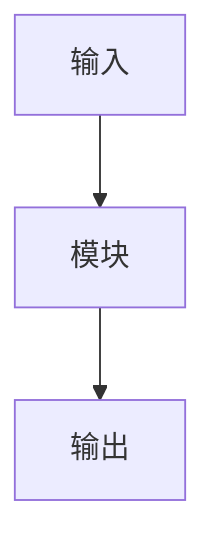

# 论文笔记：{Title}

## 元信息

| 项目 | 内容 |
|------|------|
| 机构 | {Affiliations} |
| 日期 | {Month Year} |
| 项目主页 | {project_page_url} |
| 对比基线 | [[{baseline_paper}]] |
| 链接 | [arXiv]({arxiv_url}) / [Code]({code_url}) |

---

## 一句话总结

> {用一句话概括这篇论文的核心贡献，不超过50字}

---

## 核心贡献

1. **{贡献1标题}**: {简要说明}
2. **{贡献2标题}**: {简要说明}
3. **{贡献3标题}**: {简要说明}

---

## 问题背景

### 要解决的问题
{这篇论文要解决什么问题？}

### 现有方法的局限
{之前的方法有什么不足？}

### 本文的动机
{为什么作者认为他们的方法能解决这个问题？}

---

## 方法详解

### 模型架构 (论文原图 + Mermaid)

<!-- 必做规则 (2026-07-24): 
     1. 如果论文有显式架构图 → 放这里
     2. 如果论文没有显式架构图 → 标注 "⚠️ 论文未提供显式架构图"
     3. 下面跟一个 Mermaid 流程图（编辑原有的，不新建重复的）
-->

> 论文提供显式架构图 ✅ 或 ⚠️ 论文未提供显式架构图

![[{method_name}/{架构图片名}.png]]

**图注**: {简短说明}

<!-- 只保留一个 Mermaid 图，直接编辑原有代码，不要新增重复的 -->

<!-- 使用 [[概念]] 内链所有技术术语 -->

<!-- 使用 [[概念]] 内链所有技术术语 -->

{方法名} 采用 **{架构类型}** 架构：
- **输入**: 语言指令 $l$ + 观测 $o_t$ + 状态 $s_t$
- **Backbone**: {使用的主干网络}
- **核心模块**: [[{核心技术1}]] 用于 [[{核心技术2}]]
- **输出**: [[Action Chunking|动作块]] $a_{t:t+k}$
- **总参数**: {参数量}

### 核心模块

#### 模块1: {名称}

**设计动机**: 利用 [[{相关概念}]] 实现 {目标}

**具体实现**:
- 使用 [[{技术A}]] 进行 {处理1}
- 通过 [[{技术B}]] 实现 {处理2}

#### 模块2: {名称}

{同上格式，注意内联概念链接}

---

## 关键公式

<!-- 公式标题使用 [[概念|名称]] 格式链接到概念库 -->

### 公式1: [[{概念名}|{公式用途}]]

$$
{公式内容}
$$

**含义**: {一句话解释公式的作用}

**符号说明**:
- $\tau \sim \mathcal{U}(0, 1)$: {含义}
- ${符号2}$: {含义}

### 公式2: [[{概念名}]] 损失

$$
\mathcal{L}_{total} = \lambda_1 \mathcal{L}_{task} + \lambda_2 \mathcal{L}_{reg}
$$

**含义**: {损失函数的整体作用}

**符号说明**:
- $\lambda_1, \lambda_2$: 权重系数
- $\mathcal{L}_{task}$: {任务损失作用}
- $\mathcal{L}_{reg}$: {正则项作用}

### 公式3: 采样/推理过程

$$
{推理公式}
$$

**含义**: {推理过程说明}

{... 列出论文中所有重要公式 ...}

---

## 关键图表

<!-- 图片：下载到本地 assets/ 文件夹，用 ![[]] wikilink 嵌入 -->
<!-- 命名规范: {方法名}_fig{N}_{英文描述}.png -->
<!-- 下载后必须验证：文件 >10KB、Read 确认内容正确 -->

### Figure 1: Overview / 系统概览

![[{MethodName}_fig1_overview.png]]

**说明**: {方法名} 的整体架构。输入 {输入内容}，通过 [[{核心技术}]] 处理，输出 {输出内容}。

### Figure 2: Model Architecture / 模型架构

![[{MethodName}_fig2_architecture.png]]

**说明**: 展示 [[{模块名}]] 的详细结构。{核心设计点}。

### Figure 3: Experiment Results / 实验结果

![[{MethodName}_fig3_results.png]]

**说明**: {实验的关键发现}，{方法名} 在 {指标} 上超越 baseline {百分比}。

### Table 1: {表格标题}

| Method | Metric1 | Metric2 | Metric3 |
|--------|---------|---------|---------|
| Baseline1 | x.xx | x.xx | x.xx |
| Baseline2 | x.xx | x.xx | x.xx |
| **Ours** | **x.xx** | **x.xx** | **x.xx** |

**说明**: {表格的关键发现}

### Table 2: 消融实验

| 配置 | Metric | 说明 |
|------|--------|------|
| w/o Module A | x.xx | {影响分析} |
| w/o Module B | x.xx | {影响分析} |
| Full Model | x.xx | - |

**关键发现**: {消融实验最重要的结论}

{... 列出论文中所有重要图表 ...}

---

## 实验

### 数据集

| 数据集 | 规模 | 特点 | 用途 |
|--------|------|------|------|
| {Dataset1} | {size} | {特点} | 训练/测试 |
| {Dataset2} | {size} | {特点} | 测试 |

### 实现细节

- **Backbone**: {使用的骨干网络}
- **优化器**: {Adam/SGD, 学习率}
- **Batch Size**: {大小}
- **训练轮数**: {epochs}
- **硬件**: {GPU 型号和数量}

### 可视化结果

{定性结果的关键观察}

---

## 批判性思考

### 优点
1. {优点1}
2. {优点2}
3. {优点3}

### 局限性
1. {局限1}
2. {局限2}

### 潜在改进方向
1. {改进方向1}
2. {改进方向2}

### 可复现性评估
- [ ] 代码开源
- [ ] 预训练模型
- [ ] 训练细节完整
- [ ] 数据集可获取

## 第一性原理深度分析

### [一R] Task：这篇文章解决的是什么问题？请尽可能形式化！

{用第一性原理分析：这个问题的本质是什么？输入输出是什么？约束条件有哪些？}

### [二R] Challenge：传统的方法在解决这个问题时遇到了什么挑战？

{传统方法的核心难点在哪里？为什么之前的approach会失败或不理想？}

### [三R] Insight：
① 作者的 Insight 是被什么 Inspiration 启发的？
{作者的灵感来源是什么？生物学？物理学？其他领域？之前的某个观察？}

② 作者的 Insight 究竟是什么？是在什么方面上的 Insight？对于每个 Insight，是哪些上述的 Inspiration 启发的？
{核心洞察：作者对问题本质的新理解是什么？在哪个维度上突破了传统思维？}

### [四R] Novelty
① Novelty：作者本篇文章的 Novelty 体现在何处？是否有架构上、方法上还是策略上的，支持自己 Insight 的创新？
{创新的性质：是全新的架构？新的训练策略？新的评估方式？}

② 对于每一个 Novelty, 请你清晰的严格按这个格式描述：【创新点解决的问题是什么】-> 【受哪个 insight 启发】-> 【设计了什么创新点，尽可能具体描述】
{逐条列出创新点及其逻辑链条}

### [五R] Potential flaw：
① 当前问题的情境是否有局限？有没有可能通过延伸架构，解决一些新情境（例如：维度更多、条件更多、约束更多）下的问题？
{问题的边界：当前设定是否过于简化？如何扩展到更复杂场景？}

② 在目前情境下，若数据有什么样的不好的性质，解决可能会遇到特别的困难？
{数据挑战：噪声、稀疏、不平衡、分布偏移等会带来什么困难？}

③ 在以上这些困难中，哪种困难值得深度挖掘写成 paper？
{最有研究价值的方向：哪个困难既有挑战性又有意义？}

### [六R] Motivation：
请你总结这篇文章想到 general idea 的方式，最好以问句形式给出（如：之前的方法 ..., 那可不可以尝试一下 xxx），遵循第一性原理，从问题的本质出发，找到最合理、最容易的，想到本篇文章 idea 的方式。
{idea生成的逻辑：从基本原理出发，作者是如何一步步推导出解决方案的？}

---

## 关联笔记

### 基于
- [[{前置工作1}]]: {说明}
- [[{前置工作2}]]: {说明}

### 对比
- [[{对比方法1}]]: {为什么对比}
- [[{对比方法2}]]: {为什么对比}

### 方法相关
- [[{核心技术1}]]: 核心方法
- [[{核心技术2}]]: 重要组件

### 硬件/数据相关
- [[{硬件或数据集}]]: {说明}

---

## 速查卡片

> [!summary] {Paper Title}
> - **核心**: {一句话核心}
> - **方法**: {关键方法}
> - **结果**: {主要结果}
> - **代码**: {GitHub链接}

---

## 🔍 发现来源

<!-- 仅当论文来自社交平台时显示此 section -->

> **来源**: {platform}（{platform_url}）
> **发现者**: @{author_name}
> **发现时间**: {discovery_date}

### 社区观点

> ⚠️ **注意**：以下内容来自社交平台用户的分享和评论，仅代表个人观点，**不代表论文原文**。请以原始论文为准。

#### 博主推荐语

{author_summary}

#### 热门评论

1. @{commenter1}: {comment1}
2. @{commenter2}: {comment2}
{... 最多10条 ...}

---

*笔记创建时间: {timestamp}*
